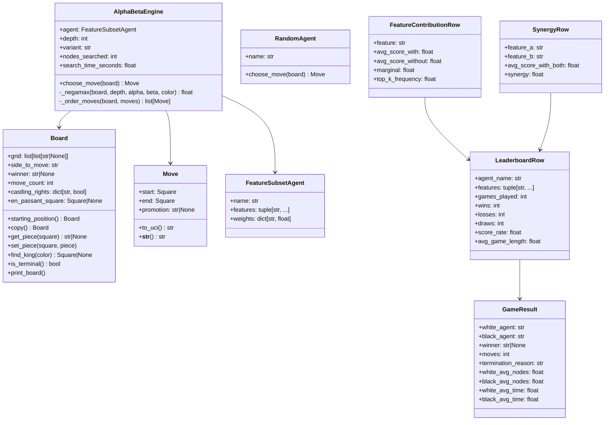
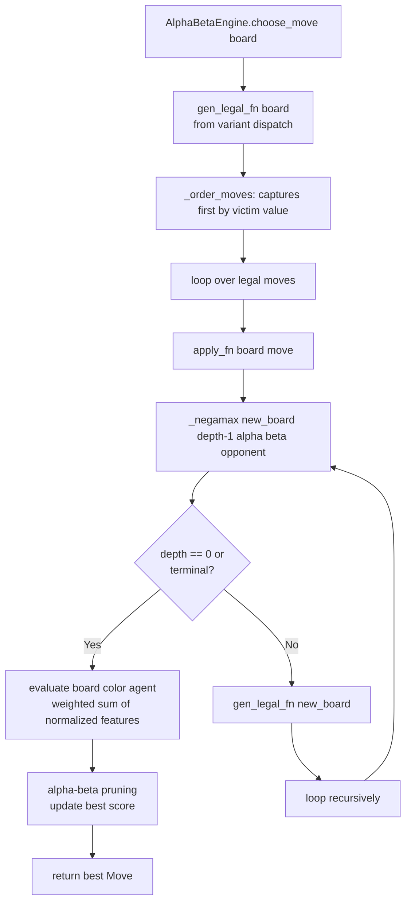
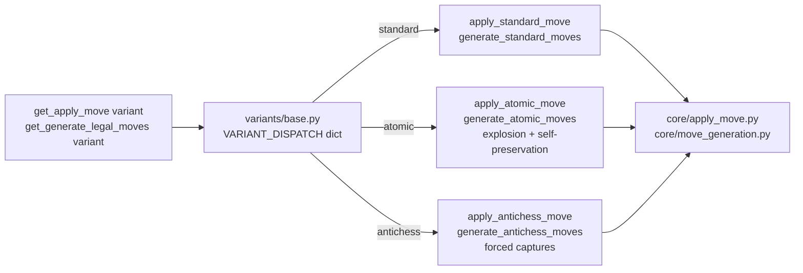
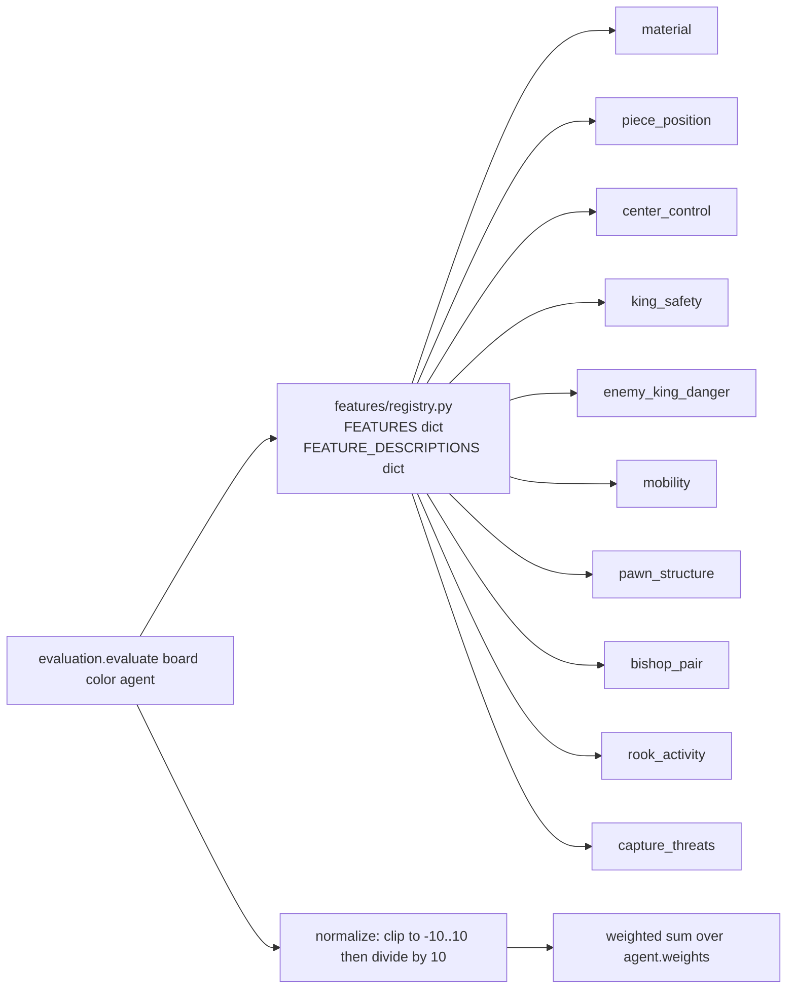
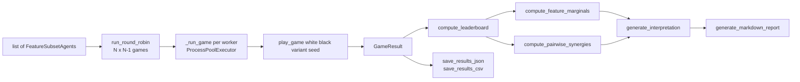
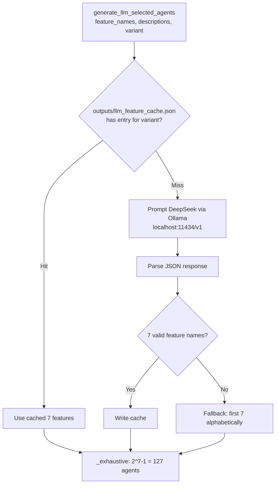

# Code-Accurate Architecture Reference — EngineLab

This file is a concise, code-verified supplement to `enginelab_mermaid_architecture.md`.
All class fields match the actual dataclasses and interfaces in the codebase.

---

## 1. Accurate Class Diagram

---

## 2. Alpha-Beta Search Path (code trace)

---

## 3. Variant Dispatch

---

## 4. Feature Registry

---

## 5. Tournament + Analysis Pipeline

---

## 6. LLM Agent Generation

