# EngineLab Mermaid Architecture Diagrams

This document separates the architecture into three scopes:

1. **Frontend** — Streamlit UI in `ui/`
2. **Backend** — chess engine, simulation, tournament, analysis, reporting modules
3. **Whole Project** — end-to-end EngineLab system

---

# 1. Frontend Architecture

## 1.1 Frontend Component Diagram

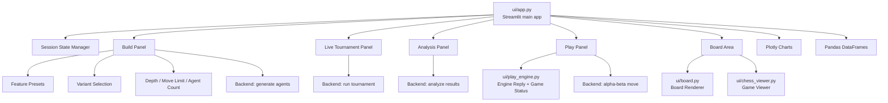
```mermaid
graph TD
    A[ui/app.py<br/>Streamlit main app] --> B[Session State Manager]
    A --> C[Build Panel]
    A --> D[Live Tournament Panel]
    A --> E[Analysis Panel]
    A --> F[Play Panel]
    A --> G[Board Area]

    C --> C1[Feature Presets]
    C --> C2[Variant Selection]
    C --> C3[Depth / Move Limit / Agent Count]

    G --> H[ui/board.py<br/>Board Renderer]
    G --> I[ui/chess_viewer.py<br/>Game Viewer]
    F --> J[ui/play_engine.py<br/>Engine Reply + Game Status]

    A --> K[Plotly Charts]
    A --> L[Pandas DataFrames]

    C --> M[Backend: generate agents]
    D --> N[Backend: run tournament]
    E --> O[Backend: analyze results]
    F --> P[Backend: alpha-beta move]
```

## 1.3 Frontend Deployment Diagram

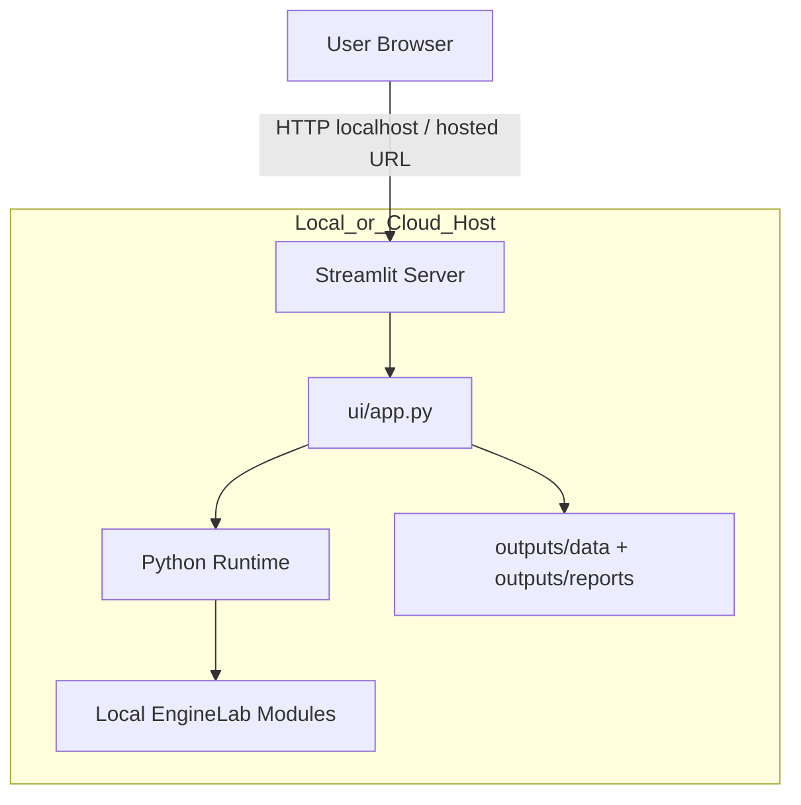
```mermaid
graph TD
    U[User Browser] -->|HTTP localhost / hosted URL| S[Streamlit Server]
    S --> APP[ui/app.py]
    APP --> PY[Python Runtime]
    PY --> MODS[Local EngineLab Modules]
    APP --> OUT[outputs/data + outputs/reports]

    subgraph Local_or_Cloud_Host
        S
        APP
        PY
        MODS
        OUT
    end
```

## 1.4 Frontend Sequence Diagram

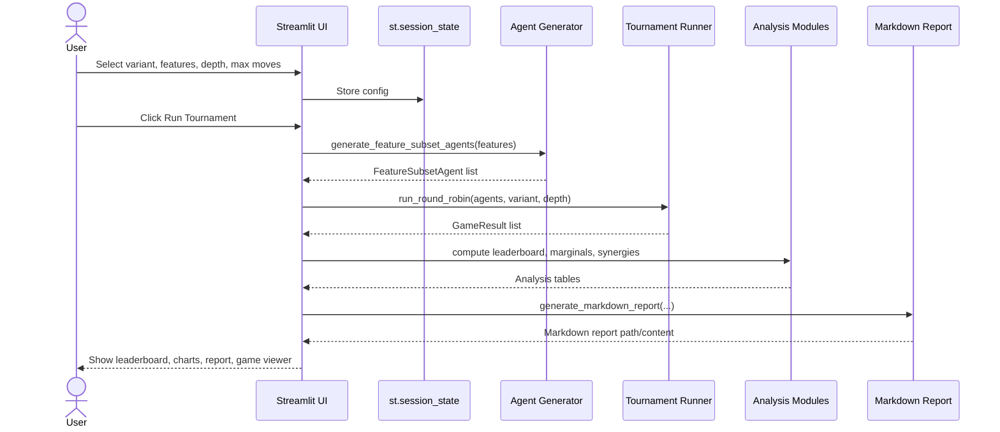
```mermaid
sequenceDiagram
    actor User
    participant UI as Streamlit UI
    participant State as st.session_state
    participant Agents as Agent Generator
    participant Tournament as Tournament Runner
    participant Analysis as Analysis Modules
    participant Report as Markdown Report

    User->>UI: Select variant, features, depth, max moves
    UI->>State: Store config
    User->>UI: Click Run Tournament
    UI->>Agents: generate_feature_subset_agents(features)
    Agents-->>UI: FeatureSubsetAgent list
    UI->>Tournament: run_round_robin(agents, variant, depth)
    Tournament-->>UI: GameResult list
    UI->>Analysis: compute leaderboard, marginals, synergies
    Analysis-->>UI: Analysis tables
    UI->>Report: generate_markdown_report(...)
    Report-->>UI: Markdown report path/content
    UI-->>User: Show leaderboard, charts, report, game viewer
```

## 1.5 Frontend Data Flow Diagram

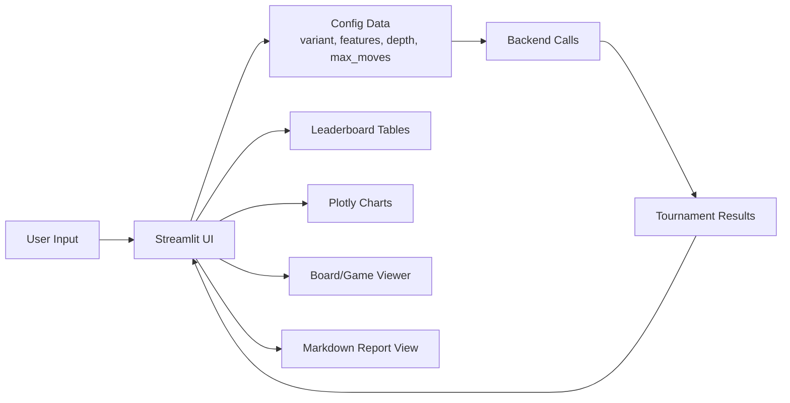
```mermaid
flowchart LR
    U[User Input] --> UI[Streamlit UI]
    UI --> CFG[Config Data<br/>variant, features, depth, max_moves]
    CFG --> BACK[Backend Calls]
    BACK --> RES[Tournament Results]
    RES --> UI
    UI --> TABLES[Leaderboard Tables]
    UI --> CHARTS[Plotly Charts]
    UI --> BOARD[Board/Game Viewer]
    UI --> REPORT[Markdown Report View]
```

## 1.6 Frontend Class Diagram

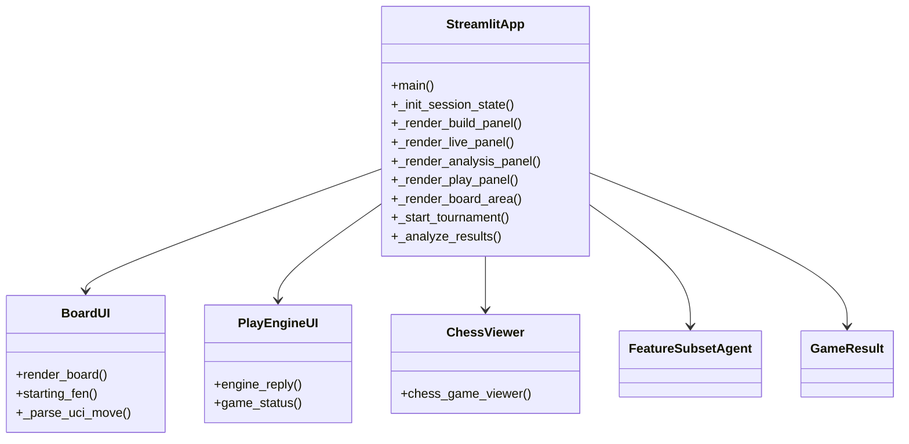
```mermaid
classDiagram
    class StreamlitApp {
        +main()
        +_init_session_state()
        +_render_build_panel()
        +_render_live_panel()
        +_render_analysis_panel()
        +_render_play_panel()
        +_render_board_area()
        +_start_tournament()
        +_analyze_results()
    }

    class BoardUI {
        +render_board()
        +starting_fen()
        +_parse_uci_move()
    }

    class PlayEngineUI {
        +engine_reply()
        +game_status()
    }

    class ChessViewer {
        +chess_game_viewer()
    }

    StreamlitApp --> BoardUI
    StreamlitApp --> PlayEngineUI
    StreamlitApp --> ChessViewer
    StreamlitApp --> FeatureSubsetAgent
    StreamlitApp --> GameResult
```

## 1.7 Frontend Activity Diagram

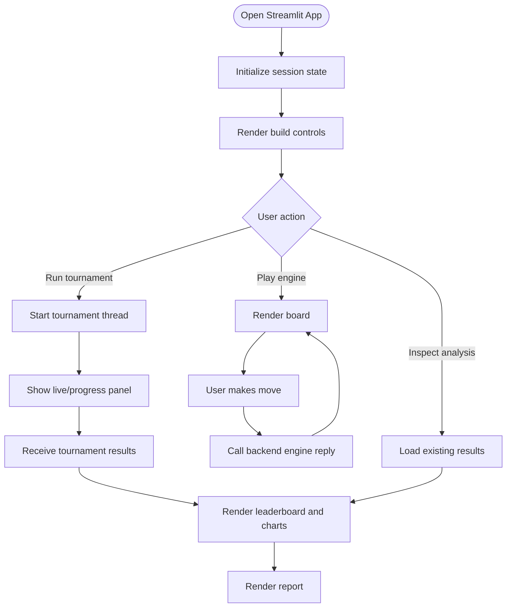
```mermaid
flowchart TD
    A([Open Streamlit App]) --> B[Initialize session state]
    B --> C[Render build controls]
    C --> D{User action}
    D -->|Run tournament| E[Start tournament thread]
    E --> F[Show live/progress panel]
    F --> G[Receive tournament results]
    G --> H[Render leaderboard and charts]
    H --> I[Render report]
    D -->|Play engine| J[Render board]
    J --> K[User makes move]
    K --> L[Call backend engine reply]
    L --> J
    D -->|Inspect analysis| M[Load existing results]
    M --> H
```

---

# 2. Backend Architecture

## 2.1 Backend Component Diagram

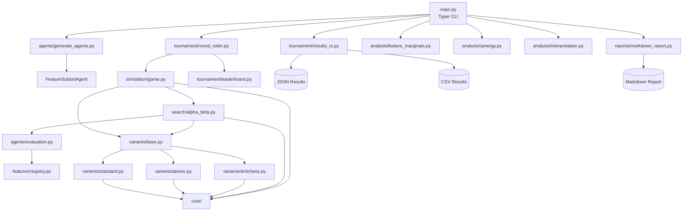
```mermaid
graph TD
    CLI[main.py<br/>Typer CLI] --> AGGEN[agents/generate_agents.py]
    AGGEN --> AGENT[FeatureSubsetAgent]

    CLI --> RR[tournament/round_robin.py]
    RR --> GAME[simulation/game.py]
    GAME --> ENGINE[search/alpha_beta.py]
    ENGINE --> EVAL[agents/evaluation.py]
    EVAL --> REG[features/registry.py]

    GAME --> VARBASE[variants/base.py]
    ENGINE --> VARBASE
    VARBASE --> STD[variants/standard.py]
    VARBASE --> ATOM[variants/atomic.py]
    VARBASE --> ANTI[variants/antichess.py]

    STD --> CORE[core/]
    ATOM --> CORE
    ANTI --> CORE
    ENGINE --> CORE
    GAME --> CORE

    RR --> LB[tournament/leaderboard.py]
    CLI --> IO[tournament/results_io.py]
    IO --> JSON[(JSON Results)]
    IO --> CSV[(CSV Results)]

    CLI --> MARG[analysis/feature_marginals.py]
    CLI --> SYN[analysis/synergy.py]
    CLI --> INT[analysis/interpretation.py]
    CLI --> REPORT[reports/markdown_report.py]
    REPORT --> MD[(Markdown Report)]
```

## 2.3 Backend Deployment Diagram

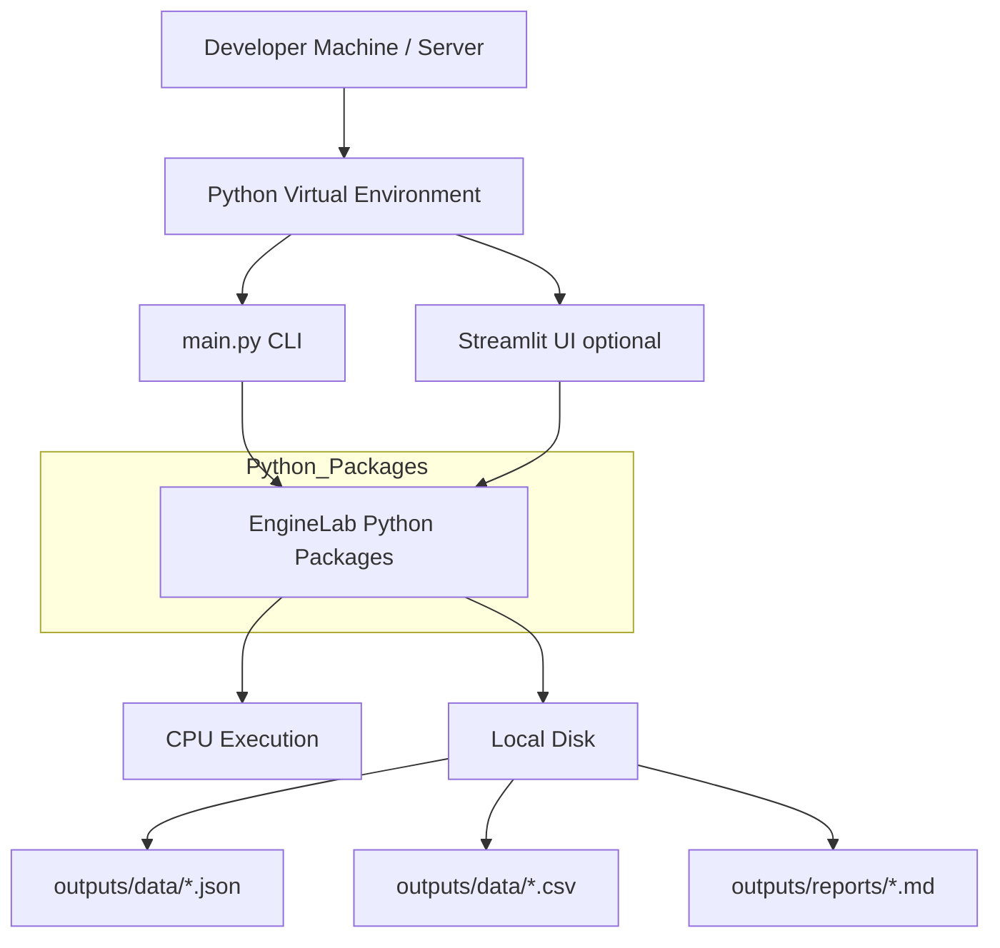
```mermaid
graph TD
    DEV[Developer Machine / Server] --> VENV[Python Virtual Environment]
    VENV --> CLI[main.py CLI]
    VENV --> UI[Streamlit UI optional]

    CLI --> MODULES[EngineLab Python Packages]
    UI --> MODULES

    MODULES --> CPU[CPU Execution]
    MODULES --> DISK[Local Disk]
    DISK --> JSON[outputs/data/*.json]
    DISK --> CSV[outputs/data/*.csv]
    DISK --> MD[outputs/reports/*.md]

    subgraph Python_Packages
        MODULES
    end
```

## 2.4 Backend Sequence Diagram

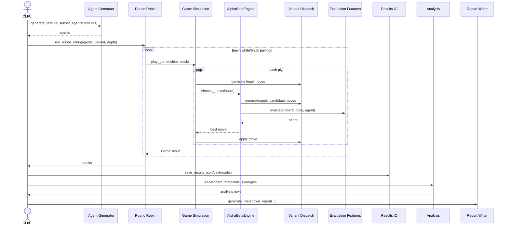
```mermaid
sequenceDiagram
    actor Caller as CLI/UI
    participant Gen as Agent Generator
    participant RR as Round Robin
    participant Game as Game Simulation
    participant Engine as AlphaBetaEngine
    participant Variant as Variant Dispatch
    participant Eval as Evaluation Features
    participant IO as Results IO
    participant Analysis as Analysis
    participant Report as Report Writer

    Caller->>Gen: generate_feature_subset_agents(features)
    Gen-->>Caller: agents
    Caller->>RR: run_round_robin(agents, variant, depth)
    loop each white/black pairing
        RR->>Game: play_game(white, black)
        loop each ply
            Game->>Variant: generate legal moves
            Game->>Engine: choose_move(board)
            Engine->>Variant: generate/apply candidate moves
            Engine->>Eval: evaluate(board, color, agent)
            Eval-->>Engine: score
            Engine-->>Game: best move
            Game->>Variant: apply move
        end
        Game-->>RR: GameResult
    end
    RR-->>Caller: results
    Caller->>IO: save_results_json/csv(results)
    Caller->>Analysis: leaderboard, marginals, synergies
    Analysis-->>Caller: analysis rows
    Caller->>Report: generate_markdown_report(...)
```

## 2.5 Backend Data Flow Diagram

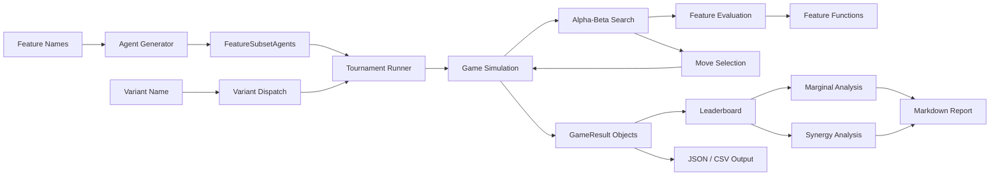
```mermaid
flowchart LR
    F[Feature Names] --> AG[Agent Generator]
    AG --> A[FeatureSubsetAgents]
    V[Variant Name] --> VD[Variant Dispatch]
    A --> T[Tournament Runner]
    VD --> T
    T --> G[Game Simulation]
    G --> AB[Alpha-Beta Search]
    AB --> FE[Feature Evaluation]
    FE --> FS[Feature Functions]
    AB --> MV[Move Selection]
    MV --> G
    G --> R[GameResult Objects]
    R --> LB[Leaderboard]
    R --> IO[JSON / CSV Output]
    LB --> MA[Marginal Analysis]
    LB --> SY[Synergy Analysis]
    MA --> REP[Markdown Report]
    SY --> REP
```

## 2.6 Backend Class Diagram

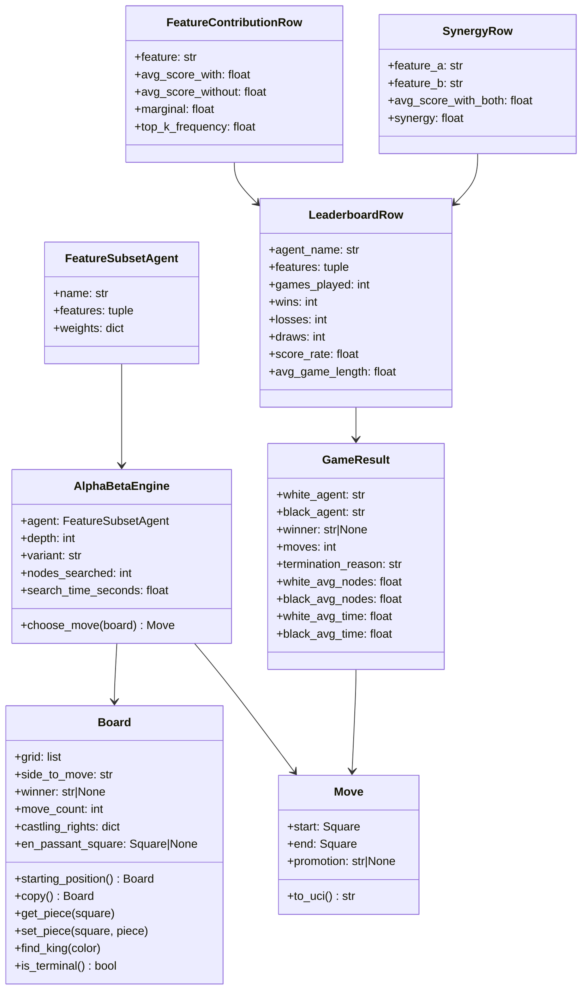
```mermaid
classDiagram
    class Board {
        +grid: list
        +side_to_move: str
        +winner: str|None
        +move_count: int
        +castling_rights: dict
        +en_passant_square: Square|None
        +starting_position() Board
        +copy() Board
        +get_piece(square)
        +set_piece(square, piece)
        +find_king(color)
        +is_terminal() bool
    }

    class Move {
        +start: Square
        +end: Square
        +promotion: str|None
        +to_uci() str
    }

    class FeatureSubsetAgent {
        +name: str
        +features: tuple
        +weights: dict
    }

    class AlphaBetaEngine {
        +agent: FeatureSubsetAgent
        +depth: int
        +variant: str
        +choose_move(board) Move
        +nodes_searched: int
        +search_time_seconds: float
    }

    class GameResult {
        +white_agent: str
        +black_agent: str
        +winner: str|None
        +moves: int
        +termination_reason: str
        +white_avg_nodes: float
        +black_avg_nodes: float
        +white_avg_time: float
        +black_avg_time: float
    }

    class LeaderboardRow {
        +agent_name: str
        +features: tuple
        +games_played: int
        +wins: int
        +losses: int
        +draws: int
        +score_rate: float
        +avg_game_length: float
    }

    class FeatureContributionRow {
        +feature: str
        +avg_score_with: float
        +avg_score_without: float
        +marginal: float
        +top_k_frequency: float
    }

    class SynergyRow {
        +feature_a: str
        +feature_b: str
        +avg_score_with_both: float
        +synergy: float
    }

    FeatureSubsetAgent --> AlphaBetaEngine
    AlphaBetaEngine --> Board
    AlphaBetaEngine --> Move
    GameResult --> Move
    LeaderboardRow --> GameResult
    FeatureContributionRow --> LeaderboardRow
    SynergyRow --> LeaderboardRow
```

## 2.7 Backend Activity Diagram

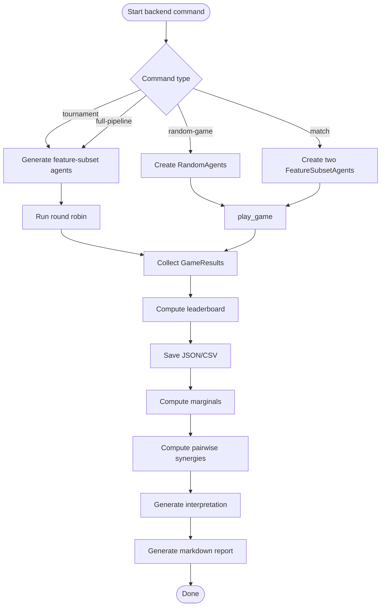
```mermaid
flowchart TD
    A([Start backend command]) --> B{Command type}
    B -->|random-game| C[Create RandomAgents]
    C --> D[play_game]
    B -->|match| E[Create two FeatureSubsetAgents]
    E --> D
    B -->|tournament| F[Generate feature-subset agents]
    F --> G[Run round robin]
    B -->|full-pipeline| F
    G --> H[Collect GameResults]
    D --> H
    H --> I[Compute leaderboard]
    I --> J[Save JSON/CSV]
    J --> K[Compute marginals]
    K --> L[Compute pairwise synergies]
    L --> M[Generate interpretation]
    M --> N[Generate markdown report]
    N --> O([Done])
```

---

# 3. Whole Project Architecture

## 3.1 Whole Project Component Diagram

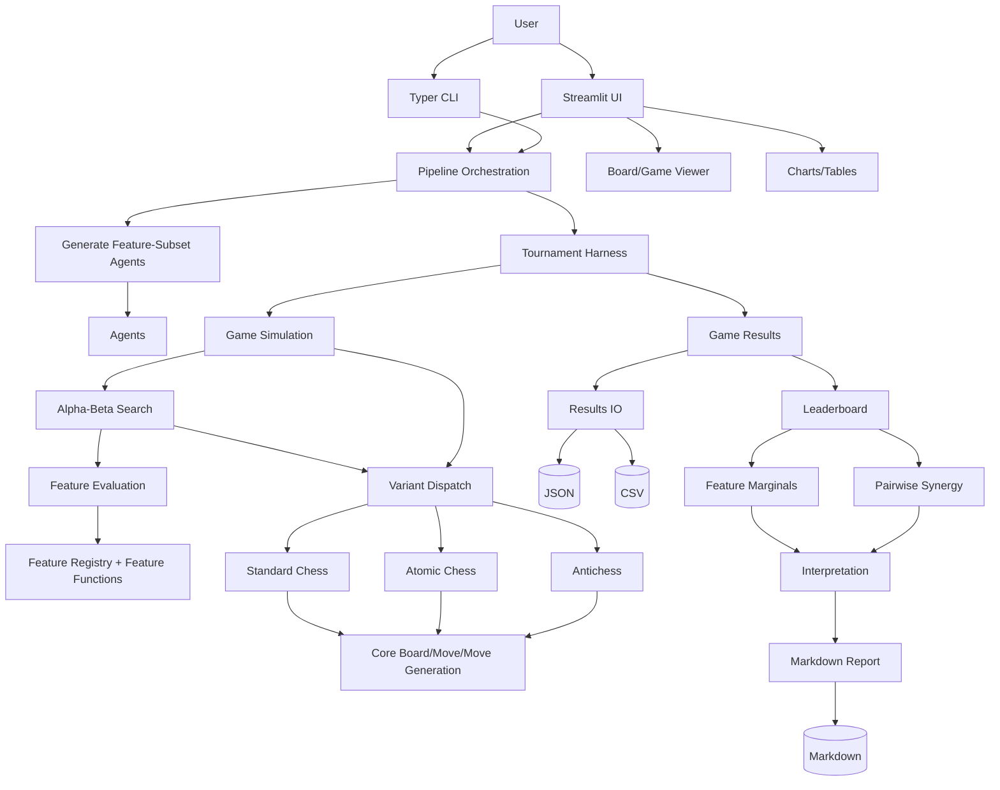
```mermaid
graph TD
    USER[User] --> UI[Streamlit UI]
    USER --> CLI[Typer CLI]

    UI --> ORCH[Pipeline Orchestration]
    CLI --> ORCH

    ORCH --> GEN[Generate Feature-Subset Agents]
    GEN --> AGENTS[Agents]
    ORCH --> TOURN[Tournament Harness]

    TOURN --> SIM[Game Simulation]
    SIM --> SEARCH[Alpha-Beta Search]
    SEARCH --> EVAL[Feature Evaluation]
    EVAL --> FEATURES[Feature Registry + Feature Functions]

    SEARCH --> RULES[Variant Dispatch]
    SIM --> RULES
    RULES --> STANDARD[Standard Chess]
    RULES --> ATOMIC[Atomic Chess]
    RULES --> ANTICHESS[Antichess]
    STANDARD --> CORE[Core Board/Move/Move Generation]
    ATOMIC --> CORE
    ANTICHESS --> CORE

    TOURN --> RESULTS[Game Results]
    RESULTS --> SAVE[Results IO]
    SAVE --> JSON[(JSON)]
    SAVE --> CSV[(CSV)]

    RESULTS --> LEADER[Leaderboard]
    LEADER --> MARG[Feature Marginals]
    LEADER --> SYN[Pairwise Synergy]
    MARG --> INTERP[Interpretation]
    SYN --> INTERP
    INTERP --> REPORT[Markdown Report]
    REPORT --> MD[(Markdown)]

    UI --> BOARDVIEW[Board/Game Viewer]
    UI --> CHARTS[Charts/Tables]
```

## 3.3 Whole Project Deployment Diagram

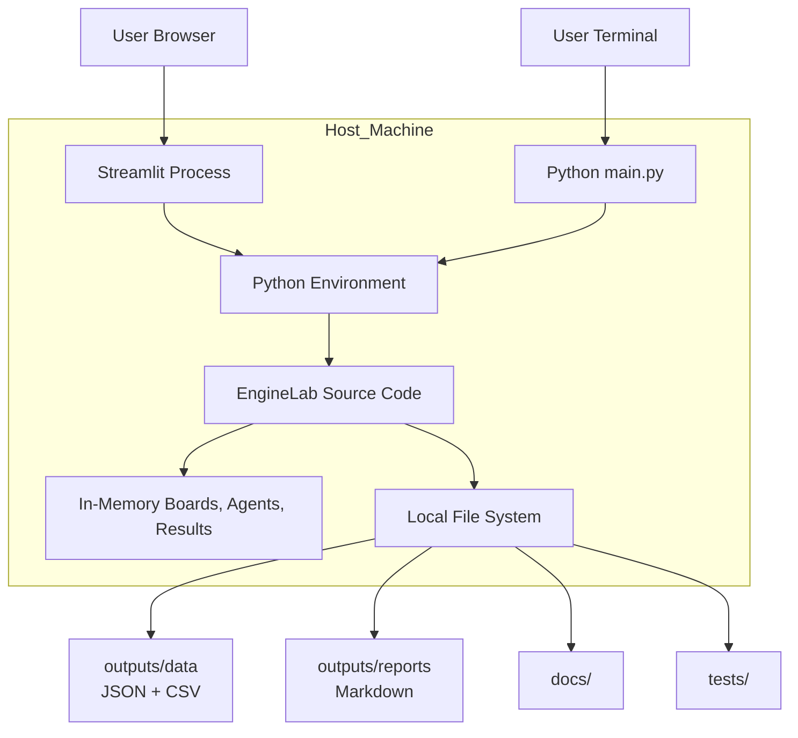
```mermaid
graph TD
    Browser[User Browser] --> Streamlit[Streamlit Process]
    Terminal[User Terminal] --> CLI[Python main.py]

    Streamlit --> PythonEnv[Python Environment]
    CLI --> PythonEnv

    PythonEnv --> ProjectCode[EngineLab Source Code]
    ProjectCode --> Memory[In-Memory Boards, Agents, Results]
    ProjectCode --> FileSystem[Local File System]

    FileSystem --> DataOut[outputs/data<br/>JSON + CSV]
    FileSystem --> ReportOut[outputs/reports<br/>Markdown]
    FileSystem --> Docs[docs/]
    FileSystem --> Tests[tests/]

    subgraph Host_Machine
        Streamlit
        CLI
        PythonEnv
        ProjectCode
        Memory
        FileSystem
    end
```

## 3.4 Whole Project Sequence Diagram

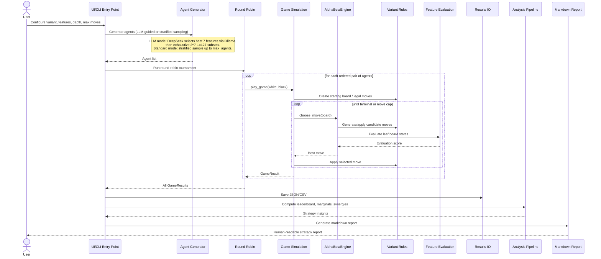
```mermaid
sequenceDiagram
    actor User
    participant Entry as UI/CLI Entry Point
    participant Agents as Agent Generator
    participant Tournament as Round Robin
    participant Game as Game Simulation
    participant Search as AlphaBetaEngine
    participant Rules as Variant Rules
    participant Features as Feature Evaluation
    participant Store as Results IO
    participant Analysis as Analysis Pipeline
    participant Report as Markdown Report

    User->>Entry: Configure variant, features, depth, max moves
    Entry->>Agents: Generate agents (LLM-guided or stratified sampling)
    Note over Agents: LLM mode: DeepSeek selects best 7 features via Ollama,<br/>then exhaustive 2^7-1=127 subsets.<br/>Standard mode: stratified sample up to max_agents.
    Agents-->>Entry: Agent list
    Entry->>Tournament: Run round-robin tournament
    loop for each ordered pair of agents
        Tournament->>Game: play_game(white, black)
        Game->>Rules: Create starting board / legal moves
        loop until terminal or move cap
            Game->>Search: choose_move(board)
            Search->>Rules: Generate/apply candidate moves
            Search->>Features: Evaluate leaf board states
            Features-->>Search: Evaluation score
            Search-->>Game: Best move
            Game->>Rules: Apply selected move
        end
        Game-->>Tournament: GameResult
    end
    Tournament-->>Entry: All GameResults
    Entry->>Store: Save JSON/CSV
    Entry->>Analysis: Compute leaderboard, marginals, synergies
    Analysis-->>Entry: Strategy insights
    Entry->>Report: Generate markdown report
    Report-->>User: Human-readable strategy report
```

## 3.5 Whole Project Data Flow Diagram

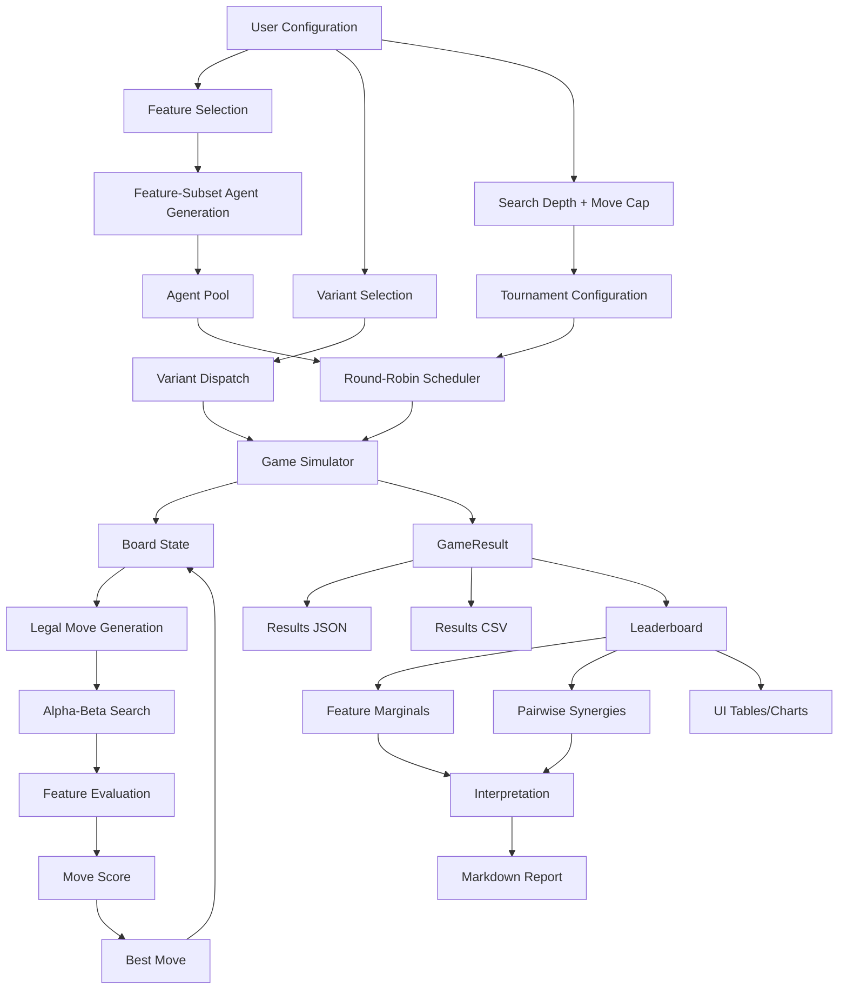
```mermaid
flowchart TD
    A[User Configuration] --> B[Feature Selection]
    A --> C[Variant Selection]
    A --> D[Search Depth + Move Cap]

    B --> E[Feature-Subset Agent Generation]
    E --> F[Agent Pool]
    C --> G[Variant Dispatch]
    D --> H[Tournament Configuration]

    F --> I[Round-Robin Scheduler]
    G --> J[Game Simulator]
    H --> I
    I --> J

    J --> K[Board State]
    K --> L[Legal Move Generation]
    L --> M[Alpha-Beta Search]
    M --> N[Feature Evaluation]
    N --> O[Move Score]
    O --> P[Best Move]
    P --> K

    J --> Q[GameResult]
    Q --> R[Results JSON]
    Q --> S[Results CSV]
    Q --> T[Leaderboard]
    T --> U[Feature Marginals]
    T --> V[Pairwise Synergies]
    U --> W[Interpretation]
    V --> W
    W --> X[Markdown Report]
    T --> Y[UI Tables/Charts]
```

---

# 4. LLM Feature Selection + Parallelized Tournament

## 4.1 LLM Feature Selection Flow

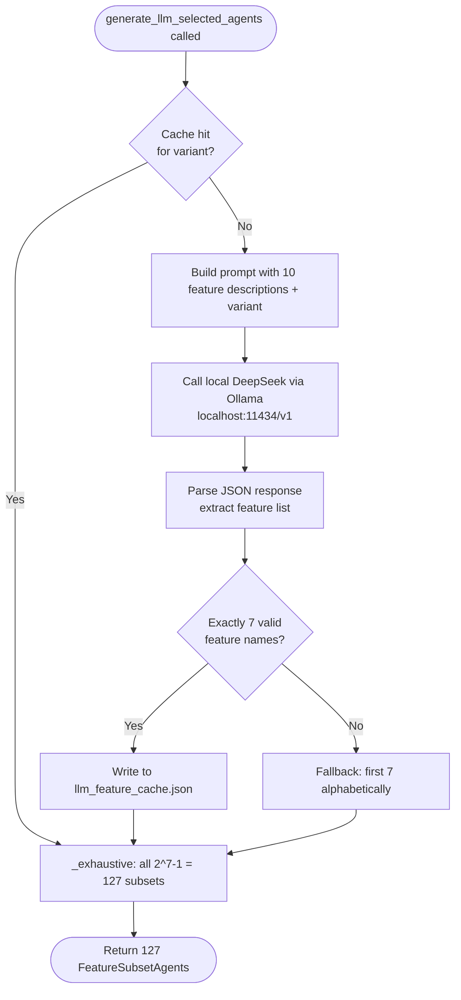
```mermaid
flowchart TD
    Start([generate_llm_selected_agents called]) --> Cache{Cache hit\nfor variant?}
    Cache -->|Yes| Exhaustive
    Cache -->|No| Prompt[Build prompt with 10 feature descriptions + variant]
    Prompt --> Ollama[Call local DeepSeek via Ollama\nlocalhost:11434/v1]
    Ollama --> Parse[Parse JSON response\nextract feature list]
    Parse --> Validate{Exactly 7 valid\nfeature names?}
    Validate -->|Yes| Save[Write to llm_feature_cache.json]
    Validate -->|No| Fallback[Fallback: first 7 alphabetically]
    Save --> Exhaustive[_exhaustive: all 2^7-1 = 127 subsets]
    Fallback --> Exhaustive
    Exhaustive --> Done([Return 127 FeatureSubsetAgents])
```

## 4.2 Parallel Tournament Execution

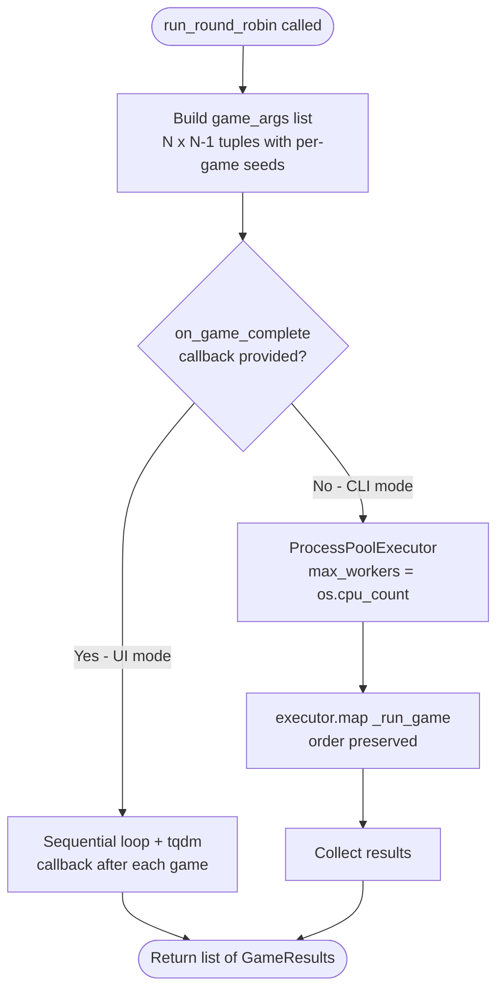
```mermaid
flowchart TD
    Start([run_round_robin called]) --> Build[Build game_args list\nN x N-1 tuples with per-game seeds]
    Build --> Check{on_game_complete\ncallback provided?}
    Check -->|Yes - UI mode| Sequential[Sequential loop + tqdm\ncallback after each game]
    Check -->|No - CLI mode| Parallel[ProcessPoolExecutor\nmax_workers = os.cpu_count]
    Parallel --> Map[executor.map _run_game\norder preserved]
    Map --> Collect[Collect results]
    Sequential --> Done([Return list of GameResults])
    Collect --> Done
```

## 4.3 LLM + Pipeline Sequence

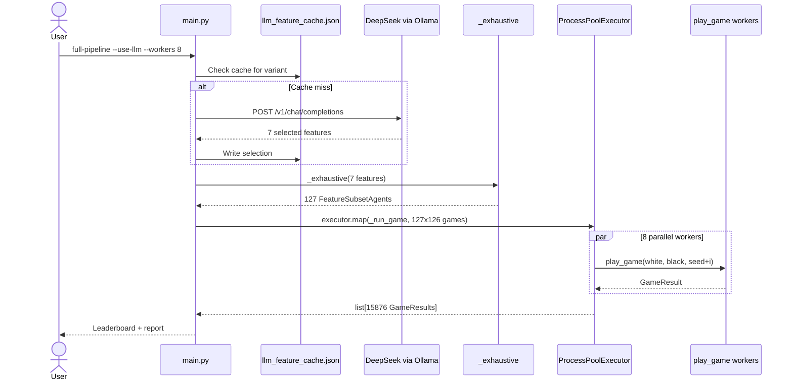
```mermaid
sequenceDiagram
    actor User
    participant CLI as main.py
    participant Cache as llm_feature_cache.json
    participant Ollama as DeepSeek via Ollama
    participant Gen as _exhaustive
    participant PPE as ProcessPoolExecutor
    participant Game as play_game workers

    User->>CLI: full-pipeline --use-llm --workers 8
    CLI->>Cache: Check cache for variant
    alt Cache miss
        CLI->>Ollama: POST /v1/chat/completions
        Ollama-->>CLI: 7 selected features
        CLI->>Cache: Write selection
    end
    CLI->>Gen: _exhaustive(7 features)
    Gen-->>CLI: 127 FeatureSubsetAgents
    CLI->>PPE: executor.map(_run_game, 127x126 games)
    par 8 parallel workers
        PPE->>Game: play_game(white, black, seed+i)
        Game-->>PPE: GameResult
    end
    PPE-->>CLI: list[15876 GameResults]
    CLI-->>User: Leaderboard + report
```

---

## 3.6 Whole Project Class Diagram

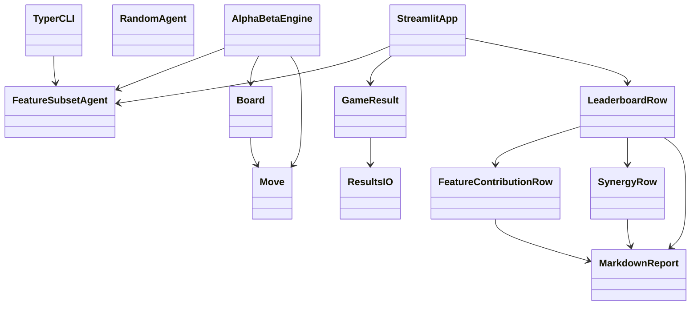
```mermaid
classDiagram
    class Board
    class Move
    class FeatureSubsetAgent
    class AlphaBetaEngine
    class RandomAgent
    class GameResult
    class LeaderboardRow
    class FeatureContributionRow
    class SynergyRow
    class StreamlitApp
    class TyperCLI
    class ResultsIO
    class MarkdownReport

    TyperCLI --> FeatureSubsetAgent
    StreamlitApp --> FeatureSubsetAgent
    StreamlitApp --> GameResult
    StreamlitApp --> LeaderboardRow

    AlphaBetaEngine --> FeatureSubsetAgent
    AlphaBetaEngine --> Board
    AlphaBetaEngine --> Move

    LeaderboardRow --> FeatureContributionRow
    LeaderboardRow --> SynergyRow
    GameResult --> ResultsIO
    FeatureContributionRow --> MarkdownReport
    SynergyRow --> MarkdownReport
    LeaderboardRow --> MarkdownReport

    Board --> Move
```

## 3.7 Whole Project Activity Diagram

```mermaid
flowchart TD
    A([Start EngineLab]) --> B{Choose entry point}
    B -->|Streamlit| C[Open UI]
    B -->|CLI| D[Run main.py command]

    C --> E[Configure experiment]
    D --> E
    E --> F[Select variant]
    F --> G[Select feature set]
    G --> H[Generate feature-subset agents]
    H --> I[Schedule round-robin games]
    I --> J[Play games]

    J --> K{Game terminal?}
    K -->|No| L[Generate legal moves]
    L --> M[Run alpha-beta search]
    M --> N[Evaluate feature scores]
    N --> O[Apply best move]
    O --> J

    K -->|Yes| P[Record GameResult]
    P --> Q{More games?}
    Q -->|Yes| I
    Q -->|No| R[Compute leaderboard]
    R --> S[Compute marginals]
    S --> T[Compute synergies]
    T --> U[Generate interpretation]
    U --> V[Save JSON/CSV/Markdown]
    V --> W[Display or present final report]
    W --> X([Done])
```
